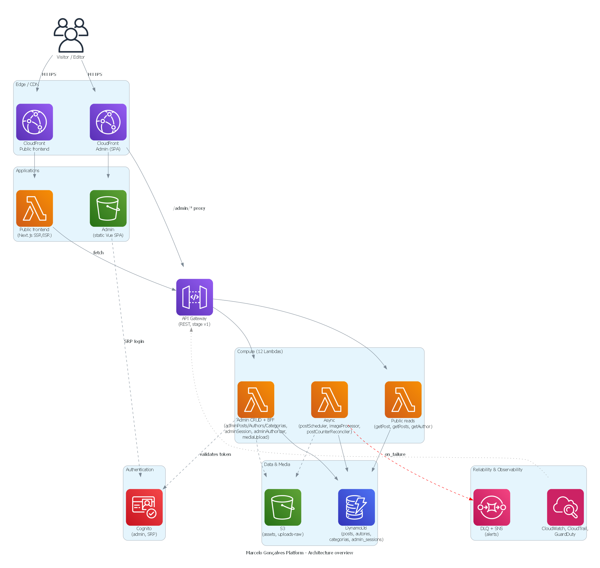
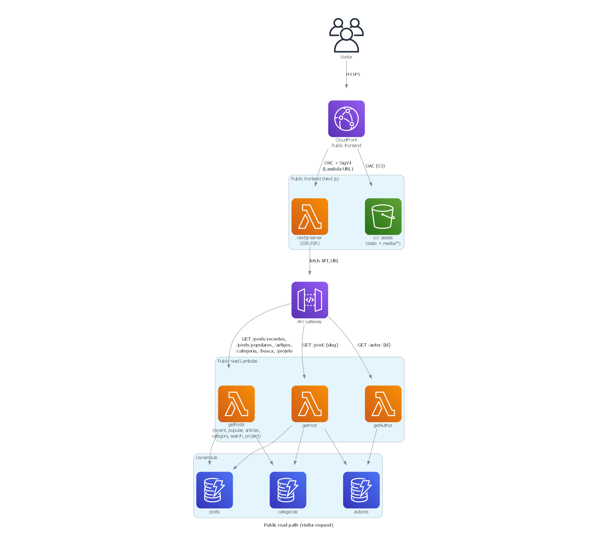
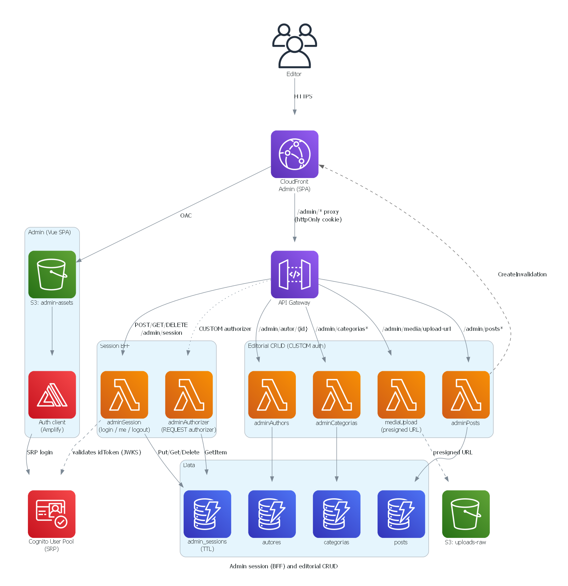
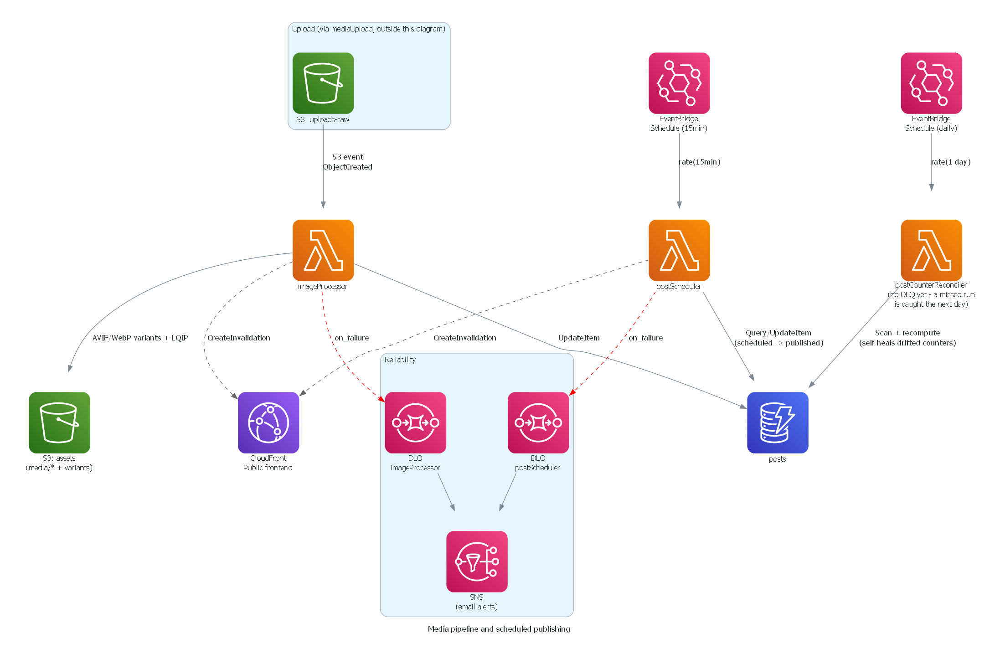
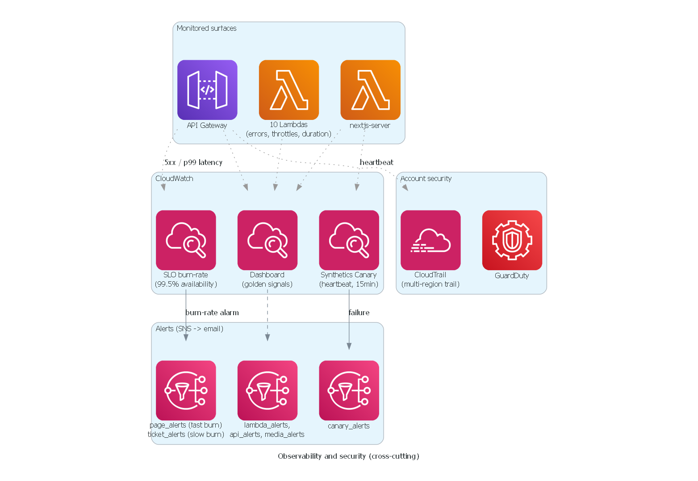

# Marcelo Gonçalves Editorial Platform

Production-grade AWS serverless platform designed and built end to end: infrastructure as code (Terraform), CI/CD via GitHub Actions with OIDC (no long-lived AWS credentials), automated testing at three levels, security scanning on every push, and full-stack observability (distributed tracing, SLO alarms, synthetic monitoring).

The application domain is an editorial platform about AI, AWS, and DevOps, with a proprietary CMS, an automated image pipeline, and (on the roadmap) an AI-assisted content generation and distribution layer.

---

## Engineering highlights

- 100% of the AWS infrastructure provisioned with Terraform — 10 modules, state in S3, linted with `tflint`.
- CI/CD via GitHub Actions using AWS OIDC (`id-token: write` + `role-to-assume`) — no long-lived cloud credentials stored as secrets.
- 11 single-responsibility Lambdas behind least-privilege IAM, reachable only through CloudFront (Lambda URL + OAC SigV4) or API Gateway.
- DynamoDB with optimistic concurrency (client-supplied `version`, `409` on conflict) and 5 GSIs with `INCLUDE` projection.
- 435 automated tests gating every deploy: unit (Jest/Vitest), integration against DynamoDB Local, and E2E (Playwright, Chromium + Firefox).
- Security gates on every push: Semgrep (SAST), Gitleaks (secret scanning), `npm audit --audit-level=high`, TFLint + Trivy on the infrastructure code.
- Distributed tracing (X-Ray) on every Lambda, CloudWatch dashboards, Synthetics Canary, SLO burn-rate alarms.
- Asynchronous workloads (S3-triggered image processing, EventBridge-triggered scheduled publishing) isolated with a DLQ + SNS alert on failure.

## What I engineered

I designed and implemented the architecture, AWS infrastructure, CI/CD pipeline, backend services, and operational/observability model of this project end to end, working solo.

That includes:

- the serverless AWS architecture (11 Lambdas, DynamoDB access patterns, CloudFront edge behavior, S3 media pipeline);
- the Terraform modules and their composition (10 modules, remote state, `tflint`-enforced);
- the CI/CD pipeline (build → lint/typecheck → unit/integration tests → security scans → Terraform validate → deploy → E2E smoke), including moving CI/CD authentication to OIDC;
- least-privilege IAM policies and the Cognito SRP + BFF opaque-session auth flow;
- the DynamoDB consistency model (optimistic concurrency, partial-update semantics on `PATCH`);
- the asynchronous processing paths (image pipeline, scheduled publishing) and their failure handling (DLQ, alarms);
- the observability model (X-Ray tracing, CloudWatch dashboards, Synthetics Canary, SLO burn-rate alerting);
- the automated test strategy across three workspaces and three test layers.

## Key engineering decisions

| Decision | Reason | Trade-off |
|---|---|---|
| Serverless AWS architecture (Lambda + DynamoDB + CloudFront) | Near-zero idle cost for a low/variable-traffic project, no server fleet to patch | More moving parts to wire together than a monolith; cold starts to account for |
| DynamoDB with GSIs (`INCLUDE` projection) instead of a relational DB | Predictable pay-per-request operation at this scale, no connection-pool management from Lambda | Access patterns must be designed up front; ad-hoc queries are harder |
| OIDC for GitHub Actions instead of static AWS access keys | Removes long-lived credentials from GitHub Secrets entirely | Requires maintaining the IAM trust policy and role scoping per environment |
| Optimistic concurrency (`version` field, `409` on stale write) instead of last-write-wins | Prevents silent data loss when a post is edited from two places | Client must track and resend the current version on every update |
| Opaque BFF session (httpOnly cookie) instead of storing the Cognito token in the browser | Keeps the JWT out of Web Storage, closing an XSS-to-token-theft path | Adds a session store (`admin_sessions` in DynamoDB) and its own cleanup/expiry logic |
| OpenNext for Next.js on Lambda instead of a container-based host (e.g. ECS/Fargate) | Keeps the public site serverless and consistent with the rest of the stack | Adds a packaging/deploy step (`server-functions/default/` ZIP) beyond plain `next build` |

---

## Overview

| | |
|---|---|
| **Public site** | Next.js 16, SSR/ISR, full SEO, "Good" Core Web Vitals |
| **CMS (admin)** | Vue 3 + Tiptap, in-house rich-text editor, not a third-party SaaS |
| **Backend** | 11 Node.js/TypeScript Lambdas, DynamoDB, S3, CloudFront |
| **Infrastructure** | Terraform, 100% IaC, no manual clicks in the AWS console |
| **Active environment** | `dev` is deployed and operational; production is designed and pipeline-ready, not yet provisioned |

---

## Stack

| Layer | Technology | Role |
|---|---|---|
| Public frontend | Next.js 16 + React 19 + OpenNext v3 | Site rendered via Lambda + CloudFront, ISR |
| CMS / Admin | Vue 3 + Vite + Pinia + Tiptap 2 | Rich-text post editor, author/category management |
| Backend | Node.js 22 + TypeScript + esbuild | 11 Lambdas, one per responsibility |
| Database | DynamoDB | Single-table-ish per entity, 5 optimized GSIs (`INCLUDE` projection) |
| Images | Sharp.js (Lambda) | Automatic pipeline: 6 variants (AVIF/WebP x 3 breakpoints) + LQIP blur |
| Auth | AWS Cognito (SRP) + BFF session | Single admin; opaque session in an httpOnly cookie (`SameSite=Strict`), stored in DynamoDB (`admin_sessions`), behind a same-origin CloudFront proxy |
| CDN / Edge | CloudFront + S3 + OAC | Managed cache/origin-request policies, on-demand invalidation on save/publish/delete |
| IaC | Terraform (~> 1.15) | 10 AWS modules, state in S3, linted with `tflint` + per-module README via `terraform-docs` |
| CI/CD | GitHub Actions | Build, lint, tests (unit + integration + E2E smoke), and `terraform apply` gating the deploy, 100% automatic on `develop` |
| Observability | CloudWatch, X-Ray, Synthetics Canary, GuardDuty, CloudTrail | Dashboards, SLO burn-rate, distributed tracing, DLQ + alarm for the 2 async Lambdas |
| Tests | Jest (backend/frontend), Vitest (admin), Playwright (E2E + post-deploy smoke) | 208 backend unit tests + 10 integration (DynamoDB Local), 81 frontend, 43 admin, 93 E2E (19 specs, run on Chromium + Firefox) |

---

## Architecture

Source of truth: `infra/` (Terraform modules). Diagrams are generated with the Python [`diagrams`](https://diagrams.mingrammer.com/) library — see `scripts/generate-architecture-diagrams-v3.py`. Re-run the script whenever the infrastructure topology changes materially.

### Overview



Layered view: edge/CDN, applications, auth, the 11 Lambdas grouped by concern, data & media, and the reliability/observability layer.

### Public read path



A visitor's request: CloudFront → Next.js SSR/ISR → API Gateway → the 3 public read Lambdas (`getPost`, `getPosts`, `getAuthor`) → DynamoDB.

### Admin session (BFF) and editorial CRUD



Editor login via Cognito (SRP), the BFF session (`adminSession`/`adminAuthorizer`, httpOnly cookie, no token in Web Storage), and the CRUD Lambdas behind the CUSTOM authorizer.

### Media pipeline and scheduled publishing



The two Lambdas with no API Gateway route: `imageProcessor` (triggered by an S3 event) and `postScheduler` (triggered by EventBridge), both with a DLQ + SNS failure path.

### Observability and security



Cross-cutting monitoring: CloudWatch dashboards, Synthetics Canary, SLO burn-rate alarms, CloudTrail, GuardDuty, and the SNS topics behind each alert.

---

## CI/CD

Working branch: `develop` (`main` is the stable snapshot). A push to `develop` triggers the full pipeline via GitHub Actions, each stage gating the next:

```
lint/typecheck → unit tests → integration tests (DynamoDB Local)
→ security scans (Semgrep, Gitleaks, npm audit)
→ Terraform validate + TFLint + Trivy → terraform apply
→ deploy (frontend, admin, Lambdas) → E2E smoke
```

AWS authentication uses OIDC (`id-token: write` + `role-to-assume`) — no long-lived AWS access keys stored in GitHub Secrets. Third-party GitHub Actions are pinned by commit SHA, not by floating version tag.

---

## Security

- Real CSP and security headers via `aws_cloudfront_response_headers_policy` (not a meta tag, which doesn't work for `X-Frame-Options`).
- Lambda URLs with `AWS_IAM` + OAC SigV4: only CloudFront can invoke them.
- Admin session via BFF: httpOnly cookie, no Cognito token in Web Storage.
- Cognito with SRP flow (`ALLOW_USER_SRP_AUTH`), no plaintext password over the network.
- DLQ (SQS) + depth alarm on the async Lambdas (`imageProcessor`, `postScheduler`), with SNS notification.
- CI pipeline blocks the deploy if lint/tests (unit, integration, or E2E smoke) fail.
- GuardDuty + CloudTrail always on, Semgrep on every CI push, `npm audit --audit-level=high` required (zero high/critical tolerated).
- `tflint` + Trivy (config scan) in the infrastructure CI.
- PITR (Point-in-Time Recovery) toggle implemented via Terraform, ready for production.

## Observability

- CloudWatch dashboards, X-Ray tracing on every Lambda, Synthetics Canary, SLO burn-rate alarms.
- Structured logging (JSON, `level`/`message`/`timestamp`/`requestId`): `console.log` is banned in the backend.

## Testing

- 208 backend tests (Jest) + 10 integration tests against DynamoDB Local + 81 frontend (Jest) + 43 admin (Vitest) + 93 E2E (Playwright, 19 specs, run on Chromium + Firefox), covering smoke, layout, post, articles, all-articles, search, category, project, and visual audit.
- A homegrown QA tool: a Playwright script that simulates a real user publishing a complete post (login, typing via input rules, image upload, every editor node type) and validates the result on two layers: an admin round-trip and the real rendered DOM of the public page (visibility, decoded image, parsed JSON-LD, admin-vs-public node count comparison, mobile + desktop).
- Compliance/legal: Google Consent Mode v2, an in-house CMP (LGPD), privacy/cookies/terms pages.

## Engineering challenges solved

**Mocks didn't catch real DynamoDB transaction/expression errors.**
Unit tests with mocked AWS SDK calls passed even when a `TransactWriteItems` call had an invalid condition expression. Added a dedicated integration-test layer (`backend/src/integration/`) running against DynamoDB Local in CI, gating the deploy on real DynamoDB behavior, not just mocked responses.

**Partial updates needed explicit delete semantics.**
A `PATCH` that merges a payload onto an existing DynamoDB item has no natural way to distinguish "field not sent, keep current value" from "field should be removed." Resolved by treating an explicit `null` on a removable field (`subtitulo`, `imagem_lqip_base64`) as a delete instruction, and an omitted field as "unchanged" — documented in the `adminPosts` contract so client and server agree.

**CloudFront's SPA error-response rewrite was masking a real 403 from the Lambda authorizer.**
The admin CloudFront distribution rewrites 403/404 to `index.html` for client-side routing. That's distribution-wide, so an actual Lambda-authorizer rejection also came back as 200 + SPA shell instead of a visible 403 — no security impact (the API call itself is still rejected server-side), but it obscured the real failure during debugging. Documented as a known robustness gap; fix requires a CloudFront Function to distinguish API paths from app routes.

---

## Product features

### Content and CMS
- In-house rich-text editor (Tiptap): headings, lists, tables, pull quotes, syntax-highlighted code blocks, semantic callouts (info/warning/error/tip), YouTube embeds, closing blocks.
- Full image pipeline: upload, `imageProcessor` Lambda (Sharp.js), 6 responsive variants (AVIF/WebP, 3 breakpoints) + inline blur placeholder (LQIP), zero extra request.
- Scheduled publishing (`postScheduler`, EventBridge + Lambda).
- Server-side HTML sanitization on every write: no raw editor HTML is ever persisted without an allowlist.

### Performance & SEO
- Real ISR on `/post/[slug]` (`generateStaticParams` + `revalidate: 60`); average LCP within the Core Web Vitals "Good" threshold.
- Modern CloudFront cache/origin-request policies on SSR routes, with edge-forced TTL for paginated listings; on-demand invalidation (`/post/{slug}` + `/`) triggered on save/publish/delete.
- 18/20 items of the SEO audit completed: JSON-LD (`BlogPosting`, `BreadcrumbList`, `Organization`, `Person`, `ProfessionalService`), Open Graph, canonical, sitemap, favicon/manifest.
- DynamoDB GSIs with `INCLUDE` projection, atomic counter of published posts (avoids a duplicate scan on pagination).
- Icons rendered as tree-shaken SVG per route (no webfont/full icon CSS loaded globally).

---

## Monorepo layout

```
mgoncalves-editorial-platform/
├── packages/contracts/  Shared Zod schemas/types (backend ↔ admin ↔ frontend contract)
├── frontend/    Next.js 16 + OpenNext v3 (public site)
├── backend/     Node.js 22 + TypeScript (11 Lambdas)
├── admin/       Vue 3 + Vite + Pinia (CMS)
├── infra/       Terraform, 10 AWS modules (lambda, dynamodb, frontend, admin,
│                api-gateway, cognito, media, observability, security-monitoring, finops)
└── .github/     CI/CD pipelines
```

**Lambdas (backend):** `getPost`, `getPosts`, `getAuthor`, `adminPosts`, `adminAuthors`, `adminCategories`, `adminSession`, `adminAuthorizer`, `mediaUpload`, `imageProcessor`, `postScheduler`.

**Posts write API (`adminPosts`):** all persisted dates use UTC in ISO 8601. `POST /admin/posts` creates (201); `PATCH /admin/post/{slug}` updates (200) with partial-update semantics — the server merges the payload onto the existing item, so a field the client omits keeps its previous value, and an explicit `null` on a removable field (`subtitulo`, `imagem_lqip_base64`) deletes it. Every update requires the client's currently-known `version` (optimistic concurrency); a stale or missing version returns 409. Both responses return `{ message, slug, version, data_atualizacao }` (`packages/contracts`' `savePostResponseSchema`) so the caller can sync local state without a follow-up GET.

`CLAUDE.md`, at the repo root, documents the project's non-negotiable engineering rules (architecture, design system, critical patterns).

---

## Local setup

```bash
npm run install:all     # installs all 4 workspaces (packages/contracts, backend, frontend, admin)

cd frontend && cp .env.example .env.local && npm run dev   # http://localhost:3000
cd admin && cp .env.example .env.local && npm run dev      # http://localhost:5173
# backend has no local server, it only runs on AWS (see backend/README.md)
```

## Tests

```bash
cd backend && npm test                  # Jest, 208 tests
cd backend && npm run test:integration  # Jest + DynamoDB Local, 10 tests
cd frontend && npm test                 # Jest, 81 tests
cd admin && npm test                    # Vitest, 43 tests
cd frontend && npm run test:e2e         # Playwright, 93 E2E tests (19 specs, Chromium + Firefox)
```

---

## Current status

The `dev` environment is deployed and operational — it's where the pipeline described in [CI/CD](#cicd) runs on every push to `develop`.

The production Terraform configuration and deploy workflow are implemented and gated by the same CI/CD pipeline as `dev`, but the production environment itself has not been provisioned yet.

The AI-assisted features listed below in [Roadmap](#roadmap) are not started; they're documented as direction, not as shipped functionality.

## Roadmap

- **Automatic AI summaries** — generated synthesis for each article, making quick reading and navigation easier.
- **English version** — multilingual publishing with its own routes, metadata, canonical, and hreflang.
- **AI-assisted translation** — translation draft generated after an editorial decision, always with human review.
- **Approved social publishing** — drafts and media for social networks, with an explicit approval step.
- **Newsletter** — optional editorial channel, gated on consent and dedicated infrastructure.
- **AI-assisted WhatsApp support** — automated initial triage, escalating to a human when needed.
- **Automated lead nurturing** — a sequence driven by reading behavior, guiding the contact toward a consulting diagnosis.
- **Proprietary ebook** — structured material built from the project's learnings and frameworks.

None of these items has implementation started as of this date.
