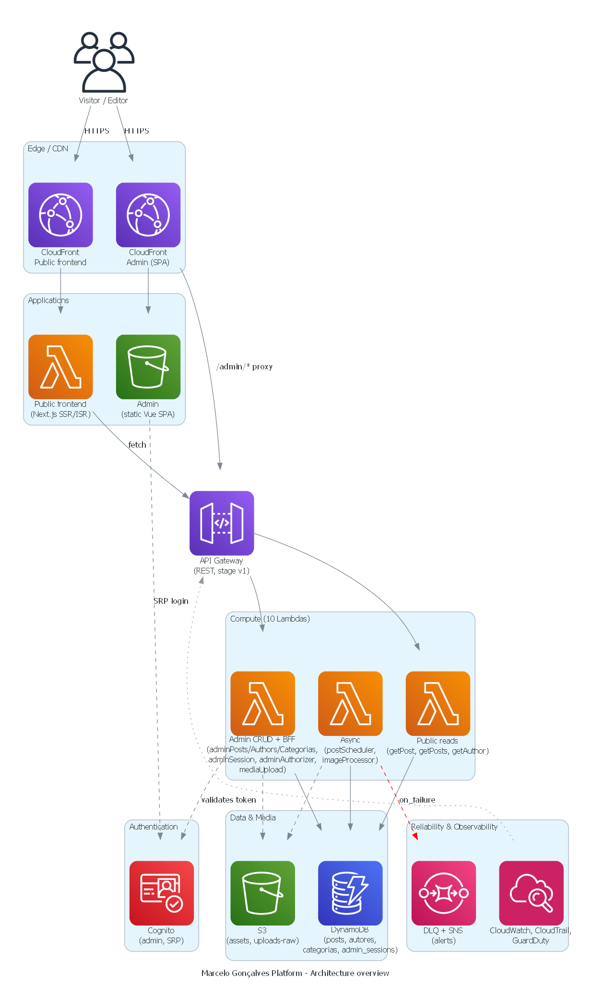
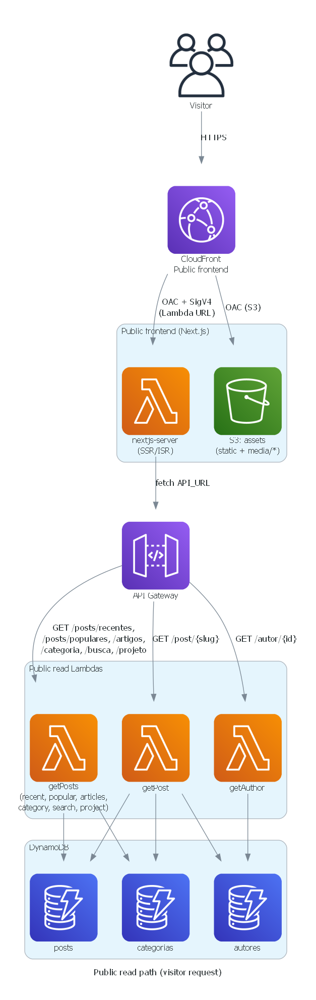
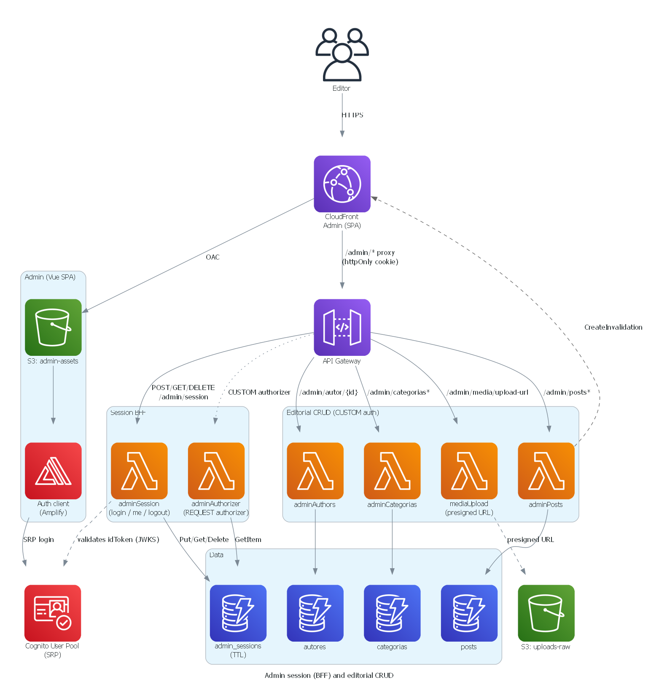
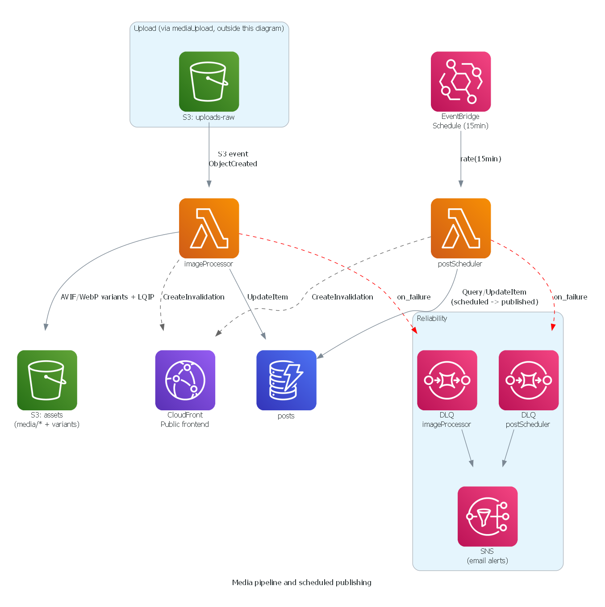

# Marcelo Gonçalves Editorial Platform

A complete editorial platform about AI, AWS, and DevOps. Not just a blog, but an end-to-end content engine: a proprietary CMS, an image pipeline, production-grade SEO/observability, and (in progress) an AI-assisted content generation and distribution layer: automatic summaries, LinkedIn repurposing, image generation, an English version, and a newsletter.

100% AWS serverless monorepo, infrastructure as code.

---

## Overview

| | |
|---|---|
| **Public site** | Next.js 16, SSR/ISR, full SEO, "Good" Core Web Vitals |
| **CMS (admin)** | Vue 3 + Tiptap, in-house rich-text editor, not a third-party SaaS |
| **Backend** | 9 Node.js/TypeScript Lambdas, DynamoDB, S3, CloudFront |
| **Infrastructure** | Terraform, 100% IaC, no manual clicks in the AWS console |
| **Active environment** | `dev` only, production doesn't exist yet |

---

## Stack

| Layer | Technology | Role |
|---|---|---|
| Public frontend | Next.js 16 + React 19 + OpenNext v3 | Site rendered via Lambda + CloudFront, ISR |
| CMS / Admin | Vue 3 + Vite + Pinia + Tiptap 2 | Rich-text post editor, author/category management |
| Backend | Node.js 20 + TypeScript + esbuild | 9 Lambdas, one per responsibility |
| Database | DynamoDB | Single-table-ish per entity, 5 optimized GSIs (`INCLUDE` projection) |
| Images | Sharp.js (Lambda) | Automatic pipeline: 6 variants (AVIF/WebP x 3 breakpoints) + LQIP blur |
| Auth | AWS Cognito (SRP) + BFF session | Single admin; opaque session in an httpOnly cookie (`SameSite=Strict`), stored in DynamoDB (`admin_sessions`), behind a same-origin CloudFront proxy |
| CDN / Edge | CloudFront + S3 + OAC | Managed cache/origin-request policies, on-demand invalidation on save/publish/delete |
| IaC | Terraform (~> 1.8) | 10 AWS modules, state in S3, linted with `tflint` + per-module README via `terraform-docs` |
| CI/CD | GitHub Actions | Build, lint, tests (unit + integration + E2E smoke), and `terraform apply` gating the deploy, 100% automatic on `develop` |
| Observability | CloudWatch, X-Ray, Synthetics Canary, GuardDuty, CloudTrail | Dashboards, SLO burn-rate, distributed tracing, DLQ + alarm for the 2 async Lambdas |
| Tests | Jest (backend/frontend), Vitest (admin), Playwright (E2E + post-deploy smoke) | ~175 backend unit tests + 5 integration (DynamoDB Local), 81 frontend, 25 admin, 80 E2E |

---

## Architecture

Source of truth: `infra/` (Terraform modules). Diagrams are generated with the Python [`diagrams`](https://diagrams.mingrammer.com/) library — see `scripts/generate-architecture-diagrams-v3.py`. Re-run the script whenever the infrastructure topology changes materially.

### Overview



Layered view: edge/CDN, applications, auth, the 10 Lambdas grouped by concern, data & media, and the reliability/observability layer.

### Public read path



A visitor's request: CloudFront → Next.js SSR/ISR → API Gateway → the 3 public read Lambdas (`getPost`, `getPosts`, `getAuthor`) → DynamoDB.

### Admin session (BFF) and editorial CRUD



Editor login via Cognito (SRP), the BFF session (`adminSession`/`adminAuthorizer`, httpOnly cookie, no token in Web Storage), and the CRUD Lambdas behind the CUSTOM authorizer.

### Media pipeline and scheduled publishing



The two Lambdas with no API Gateway route: `imageProcessor` (triggered by an S3 event) and `postScheduler` (triggered by EventBridge), both with a DLQ + SNS failure path.

### Observability and security


Cross-cutting monitoring: CloudWatch dashboards, Synthetics Canary, SLO burn-rate alarms, CloudTrail, GuardDuty, and the SNS topics behind each alert.

---

## Monorepo layout

```
marcelo-goncalves-blog/
├── frontend/    Next.js 16 + OpenNext v3 (public site)
├── backend/     Node.js 20 + TypeScript (9 Lambdas)
├── admin/       Vue 3 + Vite + Pinia (CMS)
├── infra/       Terraform, AWS modules (lambda, dynamodb, frontend, admin,
│                api-gateway, cognito, media, observability, security-monitoring, finops)
└── .github/     CI/CD pipelines
```

**Lambdas (backend):** `getPost`, `getPosts`, `getAuthor`, `adminPosts`, `adminAuthors`, `adminCategories`, `mediaUpload`, `imageProcessor`, `postScheduler`.

`CLAUDE.md`, at the repo root, documents the project's non-negotiable engineering rules (architecture, design system, critical patterns).

---

## What's already built

### Content and CMS
- In-house rich-text editor (Tiptap): headings, lists, tables, pull quotes, syntax-highlighted code blocks, semantic callouts (info/warning/error/tip), YouTube embeds, closing blocks.
- Full image pipeline: upload, `imageProcessor` Lambda (Sharp.js), 6 responsive variants (AVIF/WebP, 3 breakpoints) + inline blur placeholder (LQIP), zero extra request.
- Scheduled publishing (`postScheduler`, EventBridge + Lambda).
- Server-side HTML sanitization on every write: no raw editor HTML is ever persisted without an allowlist.

### Performance & SEO
- Real ISR on `/post/[slug]` (`generateStaticParams` + `revalidate: 60`); average LCP within the Core Web Vitals "Good" threshold.
- Modern CloudFront cache/origin-request policies on SSR routes, with edge-forced TTL for paginated listings; on-demand invalidation (`/post/{slug}` + `/`) triggered on save/publish/delete.
- 18/20 items of the SEO audit completed: JSON-LD (`BlogPosting`, `BreadcrumbList`, `Organization`, `Person`, `ProfessionalService`), Open Graph, canonical, sitemap, favicon/manifest.
- DynamoDB GSIs with `INCLUDE` projection, atomic counter of published posts (avoids a duplicate scan on pagination).
- Icons rendered as tree-shaken SVG per route (no webfont/full icon CSS loaded globally).

### Security
- Real CSP and security headers via `aws_cloudfront_response_headers_policy` (not a meta tag, which doesn't work for `X-Frame-Options`).
- Lambda URLs with `AWS_IAM` + OAC SigV4: only CloudFront can invoke them.
- Admin session via BFF: httpOnly cookie, no Cognito token in Web Storage.
- Cognito with SRP flow (`ALLOW_USER_SRP_AUTH`), no plaintext password over the network.
- DLQ (SQS) + depth alarm on the async Lambdas (`imageProcessor`, `postScheduler`), with SNS notification.
- CI pipeline blocks the deploy if lint/tests (unit, integration, or E2E smoke) fail.
- GuardDuty + CloudTrail always on, Semgrep on every CI push, `npm audit --audit-level=high` required (zero high/critical tolerated).
- `tflint` + Trivy (config scan) in the infrastructure CI.
- PITR (Point-in-Time Recovery) toggle implemented via Terraform, ready for production.

### Observability
- CloudWatch dashboards, X-Ray tracing on every Lambda, Synthetics Canary, SLO burn-rate alarms.
- Structured logging (JSON, `level`/`message`/`timestamp`/`requestId`): `console.log` is banned in the backend.

### Quality & test automation
- ~175 backend tests (Jest) + 5 integration tests against DynamoDB Local + 81 frontend (Jest) + 25 admin (Vitest) + 80 E2E (Playwright, 19 specs), covering smoke, layout, post, articles, all-articles, search, category, project, and visual audit.
- A homegrown QA tool: a Playwright script that simulates a real user publishing a complete post (login, typing via input rules, image upload, every editor node type) and validates the result on two layers: an admin round-trip and the real rendered DOM of the public page (visibility, decoded image, parsed JSON-LD, admin-vs-public node count comparison, mobile + desktop).
- Compliance/legal: Google Consent Mode v2, an in-house CMP (LGPD), privacy/cookies/terms pages.

---

## Roadmap

- **Automatic AI summaries** — generated synthesis for each article, making quick reading and navigation easier.
- **English version** — multilingual publishing with its own routes, metadata, canonical, and hreflang.
- **AI-assisted translation** — translation draft generated after an editorial decision, always with human review.
- **Approved social publishing** — drafts and media for social networks, with an explicit approval step.
- **Newsletter** — optional editorial channel, gated on consent and dedicated infrastructure.
- **AI-assisted WhatsApp support** — automated initial triage, escalating to a human when needed.
- **Automated lead nurturing** — a sequence driven by reading behavior, guiding the contact toward a consulting diagnosis.
- **Proprietary ebook** — structured material built from the project's learnings and frameworks.

None of these items has implementation started as of this date.

---

## Local setup

```bash
npm run install:all     # installs all 3 workspaces

cd frontend && cp .env.example .env.local && npm run dev   # http://localhost:3000
cd admin && cp .env.example .env.local && npm run dev      # http://localhost:5173
# backend has no local server, it only runs on AWS (see backend/README.md)
```

## Tests

```bash
cd backend && npm test                  # Jest, ~175 tests
cd backend && npm run test:integration  # Jest + DynamoDB Local, 5 tests
cd frontend && npm test                 # Jest, 81 tests
cd admin && npm test                    # Vitest, 25 tests
cd frontend && npm run test:e2e         # Playwright, 80 E2E tests (19 specs)
```

## Environment and deploy

Only `dev` exists today: production hasn't been provisioned yet. Working branch: `develop` (`main` is the stable snapshot). A push to `develop` triggers the full pipeline via GitHub Actions: build, tests, `terraform apply`, and deploy of the frontend, admin, and Lambdas.
